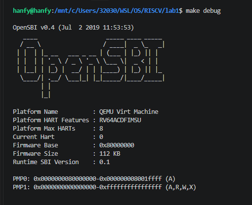
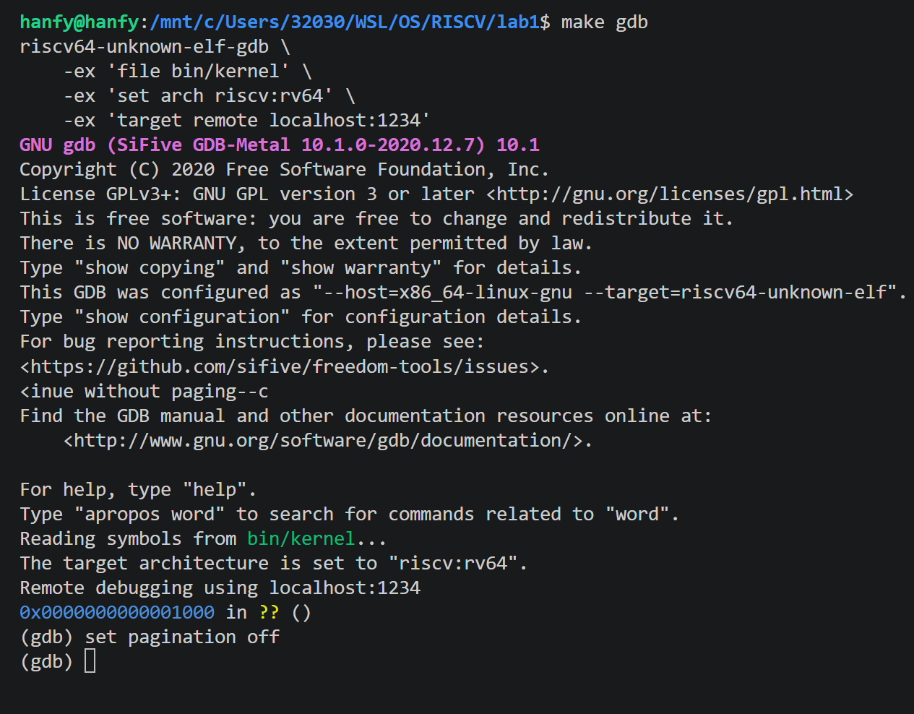
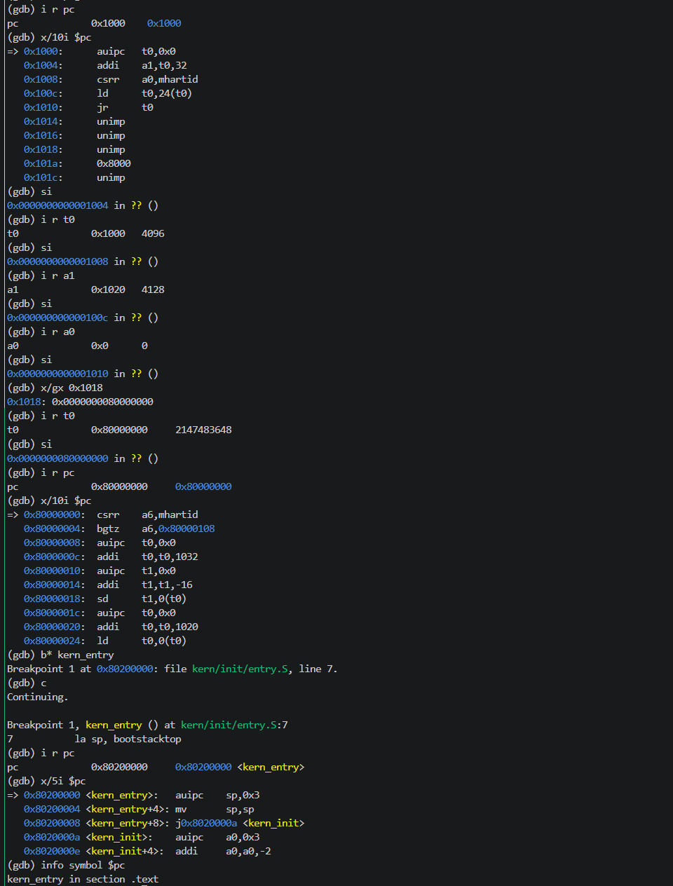

# 操作系统实验报告

## 实验基本信息

| 项目 | 内容 |
|------|------|
| **实验名称** | Lab 1: 最早可执行内核 |
| **小组成员** | 2413993-徐锐、2413340-戴璐、2413410-韩芳逸 |
| **完成日期** | 2026-10-08？ |

### 小组分工

练习如何分工？

| 成员 | 负责的练习/模块 |
|------|----------------|
| 2413993-徐锐 | 练习1 |
| 2413340-戴璐 | [练习或模块名称] |
| 2413410-韩芳逸 | 练习2 |

实验报告如何分工？

| 成员           | 负责工作         |
| -------------- | ---------------- |
| 2413993-徐锐   | 练习1，整体填写  |
| 2413340-戴璐   | [练习或模块名称] |
| 2413410-韩芳逸 | 练习2            |

---

## 实验目的

本实验的主要目的是：

1. 初步使用最小可执行内核和探索启动流程。
2. 尝试操作系统开发的基本工具。

---

## 实验环境

你们使用的 AI 工具

| 成员 | AI 编程工具 | 底层模型 | 备注 |
|------|------------|---------|------|
| 2413993-徐锐 | Codex vscode插件 | GPT6 | 无 |
| 2413340-戴璐 | | | |
| 2413410-韩芳逸 | | | |

---

## 实验整体逻辑分析

### 本章节的逻辑主线

使用最小可执行内核，探索启动流程。

### 功能的逐步实现

本章未实现任何功能。

---

## 实验内容与实现

### 功能模块：

本章未实现任何功能。

---

### 练习1：理解内核启动中的程序入口操作

**负责人：** 2413993-徐锐

`la sp, bootstacktop`将 `bootstacktop` 的地址装入栈指针寄存器 `sp`；因为 RISC-V 的栈从高地址向低地址增长，所以要把 `sp` 初始化为 `bootstacktop`，而不是 `bootstack`。总之；目的是为了完成内核栈初始化。

`tail kern_init`目的是直接跳转到 `kern_init`，不保存新的返回地址，不期望返回到 `kern_entry`。目的是将控制权永久性交给C语言内核入口，符合内核初始化的逻辑。

---
### 练习2：使用GDB验证启动流程

**负责人：** 韩芳逸

## 1. 实验目的

使用 GDB 跟踪 QEMU 模拟的 RISC-V 从加电复位开始，直到执行内核第一条指令 `0x80200000` 的完整过程。  
观察硬件加电后最初执行的指令地址、指令内容以及寄存器变化，理解 QEMU 启动固件、OpenSBI 和内核之间的控制权交接过程。

---

## 2. 实验环境与命令

### 终端 1：启动 QEMU

```bash
make debug
```

该命令编译内核并启动 QEMU，等待 GDB 连接。  
输出中可以看到 OpenSBI 启动信息：

```text
OpenSBI v0.4
Platform Name          : QEMU Virt Machine
Firmware Base          : 0x80000000
Firmware Size          : 112 KB
```

### 终端 2：启动 GDB

```bash
make gdb
```

该命令实际执行：

```bash
riscv64-unknown-elf-gdb \
    -ex 'file bin/kernel' \
    -ex 'set arch riscv:rv64' \
    -ex 'target remote localhost:1234'
```

连接成功后，GDB 停在下述位置：

```text
0x0000000000001000 in ?? ()
```

说明 QEMU 启动后，CPU 复位地址为 `0x1000`。

进入 GDB 后先关闭分页：

```gdb
set pagination off
```

---

## 3. 调试过程与观察结果

### 3.1 查看复位地址 PC

在 GDB 中输入：

```gdb
i r pc
```

输出：

```text
pc             0x1000   0x1000
```


RISC-V 硬件加电后，PC 停在 `0x1000`。该地址是 QEMU 内置启动固件的入口。

---

### 3.2 查看 `0x1000` 处的最初指令

在 GDB 中输入：

```gdb
x/10i $pc
```

输出：

```asm
=> 0x1000:      auipc   t0,0x0
   0x1004:      addi    a1,t0,32
   0x1008:      csrr    a0,mhartid
   0x100c:      ld      t0,24(t0)
   0x1010:      jr      t0
   0x1014:      unimp
   0x1016:      unimp
   0x1018:      unimp
   0x101a:      0x8000
   0x101c:      unimp
```

加电后最初执行的几条指令位于 `0x1000` 开始的位置。  

---


### 3.3 单步执行 `0x1000` 处最初指令并观察寄存器

在 GDB 中连续执行以下命令：

```gdb
si
i r t0
si
i r a1
si
i r a0
si
x/gx 0x1018
i r t0
si
i r pc
```
对应输出汇总如下：

```text
(gdb) si
0x0000000000001004 in ?? ()
(gdb) i r t0
t0             0x1000   4096
(gdb) si
0x0000000000001008 in ?? ()
(gdb) i r a1
a1             0x1020   4128
(gdb) si
0x000000000000100c in ?? ()
(gdb) i r a0
a0             0x0      0
(gdb) si
0x0000000000001010 in ?? ()
(gdb) x/gx 0x1018
0x1018: 0x0000000080000000
(gdb) i r t0
t0             0x80000000       2147483648
(gdb) si
0x0000000080000000 in ?? ()
(gdb) i r pc
pc             0x80000000       0x80000000
```

`si` 执行完当前指令后，PC 会停在下一条指令。因此，每次 `i r` 看到的是上一条指令执行后的结果。


1. 执行 `auipc t0,0x0` 后，PC 从 `0x1000` 变为 `0x1004`，`t0` 变为 `0x1000`。  
   说明该指令把当前 PC 加上 `0x0 << 12`，结果写入 `t0`。

2. 执行 `addi a1,t0,32` 后，PC 从 `0x1004` 变为 `0x1008`，`a1` 变为 `0x1020`。  
   因为此时 `t0 = 0x1000`，所以 `a1 = 0x1000 + 32 = 0x1020`。  
   在 RISC-V 启动协议中，`a1` 通常用于传递设备树 DTB 地址。

3. 执行 `csrr a0,mhartid` 后，PC 从 `0x1008` 变为 `0x100c`，`a0` 变为 `0x0`。  
   说明当前 hart ID 为 0，即主核。  
   在 RISC-V 启动协议中，`a0` 通常传递 hart ID。

4. 执行 `ld t0,24(t0)` 后，PC 从 `0x100c` 变为 `0x1010`，`t0` 变为 `0x80000000`。  
   此时旧的 `t0 = 0x1000`，所以访问地址为 `0x1000 + 24 = 0x1018`。  
   用 `x/gx 0x1018` 查看该地址，得到 `0x0000000080000000`。  
   因此这条指令从 `0x1018` 读出了下一阶段入口地址 `0x80000000`，即 OpenSBI 入口。

5. 执行 `jr t0` 后，PC 从 `0x1010` 变为 `0x80000000`。  
   说明程序跳转到 `t0` 保存的地址，控制权从 QEMU 启动固件交给 OpenSBI。

因此，加电后最初执行的几条指令位于 `0x1000` 开始的位置。  
它们的主要功能是：准备启动参数，读取 hart ID 和 DTB 地址，从 `0x1018` 加载 OpenSBI 入口 `0x80000000`，最后跳转到 OpenSBI。

---


### 3.4 进入 OpenSBI

执行 `jr t0` 后，PC 变为 `0x80000000`，进入 OpenSBI。  
在 GDB 中查看该地址开始的指令：

```gdb
x/10i $pc
```

输出：

```asm
=> 0x80000000:  csrr    a6,mhartid
   0x80000004:  bgtz    a6,0x80000108
   0x80000008:  auipc   t0,0x0
   0x8000000c:  addi    t0,t0,1032
   0x80000010:  auipc   t1,0x0
   0x80000014:  addi    t1,t1,-16
   0x80000018:  sd      t1,0(t0)
   0x8000001c:  auipc   t0,0x0
   0x80000020:  addi    t0,t0,1020
   0x80000024:  ld      t0,0(t0)
```


`0x80000000` 处是 OpenSBI 的启动代码。  
我们直接在内核入口 `kern_entry` 处下断点，让程序运行到内核开始执行的位置。

---

### 3.5 断点验证内核入口

在内核入口符号处设置断点：

```gdb
b* kern_entry
```

输出：

```text
Breakpoint 1 at 0x80200000: file kern/init/entry.S, line 7.
```

 
`b* kern_entry` 等价于 `break *kern_entry`，表示在符号 `kern_entry` 对应的地址处设置执行断点。  
GDB 根据调试符号将其解析为地址 `0x80200000`，对应源文件 `kern/init/entry.S` 第 7 行。  
这说明链接脚本指定的内核入口正是 `0x80200000`，调试符号也已正确加载。

然后继续运行：

```gdb
c
```

输出：

```text
Continuing.

Breakpoint 1, kern_entry () at kern/init/entry.S:7
7           la sp, bootstacktop
```

 
`c` 表示继续执行。OpenSBI 完成初始化后，最终跳转到 `0x80200000`，命中刚才设置的 1 号断点。  
GDB 显示当前停在 `kern_entry` 函数，源文件 `kern/init/entry.S` 第 7 行，即将执行的源码是 `la sp, bootstacktop`。  
这说明控制权已经从 OpenSBI 移交给内核，内核开始执行第一条指令。

随后查看当前 PC：

```gdb
i r pc
```

输出：

```text
pc             0x80200000       0x80200000 <kern_entry>
```

PC 当前为 `0x80200000`，对应符号 `kern_entry`，确认内核入口地址正确。

查看内核入口处的指令：

```gdb
x/5i $pc
```

输出：

```asm
=> 0x80200000 <kern_entry>:     auipc   sp,0x3
   0x80200004 <kern_entry+4>:   mv      sp,sp
   0x80200008 <kern_entry+8>:   j       0x8020000a <kern_init>
   0x8020000a <kern_init>:      auipc   a0,0x3
   0x8020000e <kern_init+4>:    addi    a0,a0,-2
```

内核入口第一条指令是 `auipc sp,0x3`，用于计算内核栈顶地址并设置栈指针 `sp`。  
第二条 `mv sp,sp` 实际是 `addi sp,sp,0`，因为 `bootstacktop` 的低 12 位为 0，所以看起来像空操作。  
第三条 `j 0x8020000a <kern_init>` 直接跳转到 C 函数 `kern_init`，开始内核初始化。

最后查看当前 PC 对应的符号：

```gdb
info symbol $pc
```

输出：

```text
kern_entry in section .text
```

当前 PC 对应符号 `kern_entry`，位于 `.text` 段，确认已经停在内核代码入口处。  


OpenSBI 完成初始化后，最终跳转到 `0x80200000`，即内核入口 `kern_entry`。  
内核第一条指令 `auipc sp,0x3` 用于设置内核栈指针，随后跳转到 `kern_init` 执行 C 代码。


---

## 4. 问题回答

### 问题：RISC-V 硬件加电后最初执行的几条指令位于什么地址？它们主要完成了哪些功能？

**答案：**

在 QEMU 模拟的 RISC-V `virt` 机器上，RISC-V 硬件加电后，CPU 最初从：

```text
0x1000
```

开始执行指令。

最初几条指令为：

```asm
0x1000: auipc t0,0x0
0x1004: addi  a1,t0,32
0x1008: csrr  a0,mhartid
0x100c: ld    t0,24(t0)
0x1010: jr    t0
```

它们的主要功能如下：

| 指令 | 功能 |
|---|---|
| `auipc t0,0x0` | 获取当前 PC 附近地址，`t0 = 0x1000` |
| `addi a1,t0,32` | 设置 `a1 = 0x1020`，通常指向设备树 DTB |
| `csrr a0,mhartid` | 读取当前 hart ID，主核为 `a0 = 0` |
| `ld t0,24(t0)` | 从地址 `0x1018` 读取下一阶段入口 `0x80000000` 到 `t0` |
| `jr t0` | 跳转到 `0x80000000`，进入 OpenSBI |

因此，加电后最初执行的指令位于 `0x1000`，这些指令完成启动参数准备，并跳转到 OpenSBI。OpenSBI 再进行主初始化，最终跳转到内核入口 `0x80200000`。

---

## 5. 结论

通过 GDB 跟踪 QEMU 模拟的 RISC-V 启动过程，可以清晰看到启动链：

```text
0x1000  QEMU 启动固件
   ↓
0x80000000  OpenSBI
   ↓
0x80200000  内核 kern_entry
```

硬件加电后最初执行的指令位于 `0x1000`，主要完成：

1. 获取当前 PC；
2. 设置 DTB 地址到 `a1`；
3. 读取 hart ID 到 `a0`；
4. 从 `0x1018` 加载 OpenSBI 入口 `0x80000000`；
5. 跳转到 OpenSBI。

OpenSBI 完成初始化后，将控制权交给内核入口 `0x80200000`，内核开始执行 `kern_entry` 的第一条指令 `auipc sp,0x3`，设置内核栈。

---

## 测试与验证

本章不存在整体测试与验证。

---

## 实验总结与收获

### 对操作系统的理解

本实验是对于操作系统内核初始化的初探，没有对于操作系统的过多理解。

### AI 协作开发的经验

AI确实很厉害 :thumbsup: 。

---

